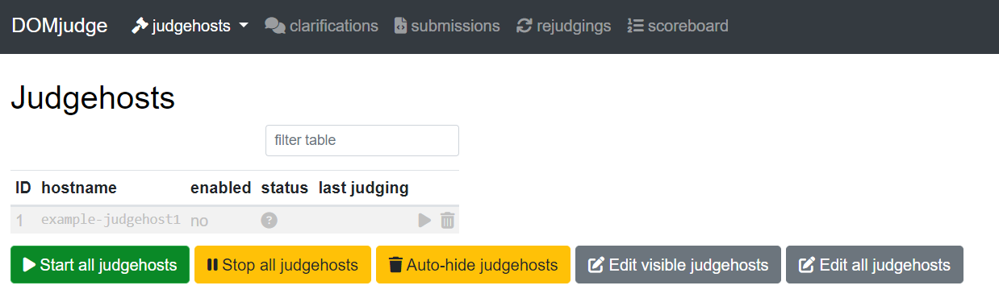

# Getting started with DOMJudge

All the information you need to get started with DOMJudge. This guide based on Ubuntu 22.04 LTS.

1. Configure `/etc/default/grub`
   ```bash
   sudo vim /etc/default/grub
   ```
    add the following line to `GRUB_CMDLINE_LINUX_DEFAULT`
   ```bash
   GRUB_CMDLINE_LINUX_DEFAULT="quiet cgroup_enable=memory swapaccount=1 systemd.unified_cgroup_hierarchy=0"
   ```

   then run
    ```bash
    sudo update-grub
    sudo reboot
    ```
    > As for the judgehost, you need to run the container in privileged mode to use cgroups. This is not recommended, but it is the only way to get it working. If you know a better way, please let me know. On this step you have to make sure that the command doesn't return any error.

2. Install docker and docker-compose
    ```bash
    curl -fsSL https://get.docker.com -o get-docker.sh
    sudo sh get-docker.sh
    ```
    > For more information, see [Docker documentation](https://docs.docker.com/engine/install/ubuntu/)

3. For running domserver (Web-UI) 
   
   note : `Don't forget to setup the env file`
   ```bash
   sudo docker compose -f docker-compose-domserver.yml up -d
   ```

4. Get the password for the admin user
   ```bash
    sudo docker exec -it domserver cat /opt/domjudge/domserver/etc/initial_admin_password.secret
   ```
    > The default username is `admin`

    If the output is `[unknown]`
    ```bash
    sudo docker exec -it domserver /opt/domjudge/domserver/webapp/bin/console domjudge:reset-user-password admin
    ```

5. Get the password for the judgehost user
   ```bash
    sudo docker exec -it domserver cat /opt/domjudge/domserver/etc/restapi.secret
   ```
    if the output is `[unknown]`, then run
    ```bash
    sudo docker exec -it domserver /opt/domjudge/domserver/webapp/bin/console domjudge:reset-user-password judgehost
    ```

6. Change judgehost.env file, add the password for judgehost user

7. Run judgehost
   ```bash
   sudo docker compose -f docker-compose-judgehost.yml up -d
   ```

8. If the judgehost has been successfully connected, you can see the judgehost in this dashboard.if you didn't see the judgehost, you can check the logs
   ```bash
   sudo docker logs judgehost
   ```
   most likely the problem is the password for the judgehost user is wrong and the judgehost can't connect to the domserver (CGroups problem)

---
# Additional information
## MariaDB
if you want to access the database, you can use the following command
```bash
docker exec -it mariadb mariadb -u domjudge -pdjpw
MariaDB [(none)]> USE domjudge;
```
or from the host machine
```bash
mariadb -h localhost -P 13306 -u domjudge -pdjpw
MariaDB [(none)]> USE domjudge;
```

## Upload limits
The custom built images have these limits set to 2GB by default! Otherwise, to upload files larger than 256MB (e.g. large problem sets), use this to increase the limits in the fpm config:
```bash
docker exec -it domserver sed -ri -e 's/(php_admin_value\[memory_limit\] =).*/\1 -1/' -e 's/(php_admin_value\[upload_max_filesize\] =).*/\1 2G/' -e 's/(php_admin_value\[post_max_size\] =).*/\1 2G/' /opt/domjudge/domserver/etc/domjudge-fpm.conf
docker exec -it domserver supervisorctl restart php
```
Admittedly, this is a bit hacky, but it works and is better than rebuilding the container.

Also be sure to increase the `client_max_body_size` in your nginx config of the host server.

## Judgehost
The judgehost is based on ubuntu:jammy. If you want to support more programming languages, you need to edit `install_languages.sh` inside the docker folder to enable, disable, add or update languages. You can add arbitrary packages or PPAs to support more. Currently, the script tries to install up-to-date versions of the languages, as of writing.

Enter the judgehost container and chroot to verify that everything is set up correctly:
```bash
docker exec -it judgedaemonX /bin/bash
docker exec -it judgedaemonX /opt/domjudge/judgehost/bin/dj_run_chroot
```
As of writing, the following languages are installed:

- Bash (GNU Bash 5.1)
- C (gcc 12.1 with C2X)
- C++ (gcc 12.1 with C++23)
- Haskell (GHC 8.8)
- Java (OpenJDK 19)
- JavaScript (Node.js 20.3 with ES2023)
- PyPy3 (7.3 with Python 3.9)
- Python3 (Python 3.11) (with numpy & scipy)
- Rust (Rust 1.65)

## Updating
To update the containers, fetch the latest images or change the version specified in the compose file by running:
```bash
sudo docker compose -f docker-compose-domserver.yml pull
sudo docker compose -f docker-compose-judgehost.yml pull
```
Then, restart the containers:
```bash
sudo docker compose -f docker-compose-domserver.yml up -d
sudo docker compose -f docker-compose-judgehost.yml up -d
```

## Troubleshooting
If you have problems trying to run the containers, you can check the logs:
```bash
sudo docker logs domserver
sudo docker logs judgehost
```